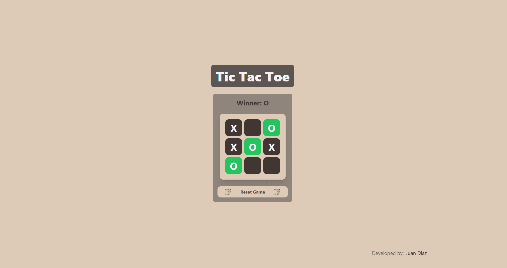
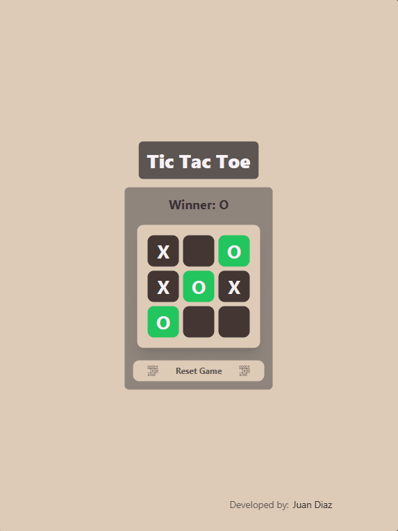
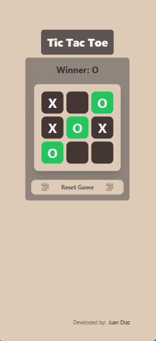

<div id="top"></div>

# Tic Tac Toe 🎮

Tic Tac Toe, reborn for the web! Two minds clash on a digital canvas, a 3x3 grid their battlefield. X's and O's, wielded like warriors, dance across the squares, vying for dominance. With each click, tension grows, a web of strategy spun. Can you outsmart your opponent, forge an unyielding line, and declare victory? Or will their cunning counter, leaving your hopes scattered like empty squares? This timeless dance of wit, now in React's embrace, invites you to test your skill, prove your cunning, and crown yourself web-woven champion. Are you ready to play?

## Description 💡

This project was built as part of the **[freeCodeCamp’s legacy Front End Development Certification]()**. The goal was to build a Tic Tac Toe with React.

<div align="center">

[](https://tictactoe.jpdiaz.dev/)
[](https://pr.new/github.com/JuanPabloDiaz/ticTacToe)

</div>

### Desktop View 🖥️



### iPad view 📱



### Mobile view 📱



## Features:

- Responsive design: [Tic Tac Toe](https://tictactoe.jpdiaz.dev) adapts to any screen size, ensuring a consistent and enjoyable experience for all users.
- Sleek and modern UI: Tailwind CSS provides a beautiful and intuitive user interface.
- Efficient and performant: Vite.js ensures fast loading times and a smooth experience.

### Built With 🔑

Welcome to the classic [Tic Tac Toe](https://tictactoe.jpdiaz.dev) game, built with React.js, Vite.js, and Tailwind CSS. It features a sleek and modern UI, responsive design, and efficient performance.


Here's a closer look at the tech stack:

- Front-End: React.js, Vite.js, Tailwind CSS
- Back-End: N/A
- Deployment: Vercel

## Get started 🛠️

To get started with [Tic Tac Toe](https://tictactoe.jpdiaz.dev), simply clone the repository and follow the setup instructions. You'll be up and running in no time!

### Setup 📋

1. Clone the repo
2. Install dependencies
   ```sh
   npm install
   ```
3. Start the development server
   ```sh
   npm run dev
   ```
4. Open [http://localhost:5173/](http://localhost:5173/) with your browser to see the result.

## Contribution 🤝

I welcome contributions to the [Tic Tac Toe](https://tictactoe.jpdiaz.dev)! Feel free to fork the repository and submit pull requests with your improvements.

## License 📜

[Tic Tac Toe](https://25.jpdiaz.dev) is licensed under the MIT License.

I hope you enjoy using the Tic Tac Toe!

<!-- OTHER PROJECTS -->

## Other Projects 🚀


[](https://github.com/JuanPabloDiaz/platzi/tree/main/2021)
[](https://github.com/JuanPabloDiaz/platzi/tree/main/2022)
[](https://github.com/JuanPabloDiaz/platzi/tree/main/2023)

<!-- CONTACT -->

## Contact 📞

[](https://www.linkedin.com/in/1diazdev/)
[](https://www.twitter.com/1diazdev)
[](mailto:juan.diaz93@hotmail.com)

[](https://platzi.com/p/DiazJuan/)

<!-- ACKNOWLEDGMENTS -->

## Acknowledgments 📚

Resources list that I find helpful and would like to give credit to.

- [Other projects](https://wongyc-66.github.io/odin-TicTacToe/)
- [Tic Tac Toe](https://codepen.io/freeCodeCamp/pen/KzXQgy)
- [Tailwind CSS](https://tailwindcss.com/)
- [Vite.js](https://vitejs.dev/)
- [React.js](https://reactjs.org/)
- [Vercel](https://vercel.com/)

<p align="right">(<a href="#top">👆 Top 👆</a>)</p>
